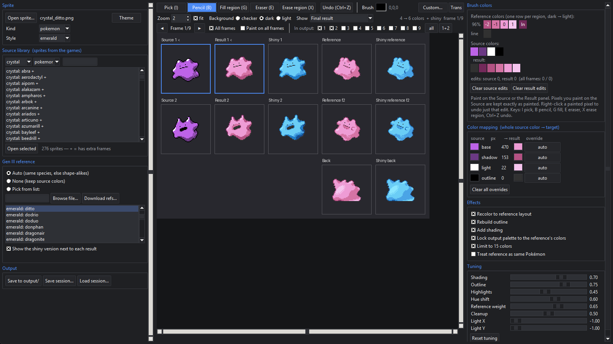
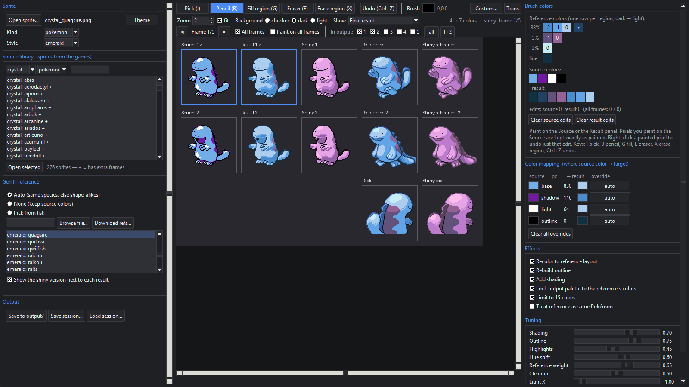

# PokeRevamp Assistant

An editor for turning Game Boy / Game Boy Color Pokémon sprites (Red/Blue, Yellow, Gold,
Silver, Crystal) into Game Boy Advance-style revamps (Emerald / FireRed look: 64×64,
≤15 colors, colored outlines, real shading).

It is an **assistant, not a converter**. An automatic pass lays the official Gen III colors,
outline and shading onto your sprite; you then finish it by hand with the paint tools while
the preview updates live.

## Screenshots





## Setup

Needs Python 3.11+ (with tkinter, included in the standard installers) and Git.

```powershell
python -m venv .venv
.\.venv\Scripts\Activate.ps1
pip install -e .
gbc_to_gba_pokerevamp --bootstrap     # one time: downloads the Gen I–III sprites
```

## Run

```powershell
gbc_to_gba_pokerevamp                              # open the editor
gbc_to_gba_pokerevamp .\input\crystal_totodile.png # open with a sprite loaded
```

## The editor

**Left column**

- **Sprite** – open a PNG; kind (pokemon / trainer) and style (emerald, frlg, gen3-mixed).
- **Source library** – every GB/GBC sprite from the games; double-click to open. `+` = has extra frames.
- **Gen III reference** – *Auto* picks the same species; *Pick* lets you choose any sprite; *None* keeps the source colors. Shiny is shown by default.
- **Output** – *Save to output/* writes `output\<name>\revamped.png`, `revamped_shiny.png`, `compare.png` and `session.json` (plus `revamped_frames.png` / `revamped_shiny_frames.png` when several frames are selected). *Load session…* restores everything, including your paint edits.

**Center – toolbar and preview**

- Tools: **Pick** (I), **Pencil** (B), **Fill region** (G), **Eraser** (E), **Erase region** (X), **Undo** (Ctrl+Z). **Custom…** picks any brush color; **Transparent** makes the brush erase.
- Each frame is a row: Source ❘ Result ❘ Shiny ❘ Reference ❘ Shiny reference. The last row shows the reference's back sprites. Every reference panel can be color-picked from.
- Paint on the Source or the Result. Painted pixels are kept exactly as painted; the automatic pass never touches them. Right-click a painted pixel to remove that edit.
- **Frame row** (multi-frame sprites): step frames with ◀ ▶, **All frames** shows every frame at once, **Paint on all frames** applies each stroke to every frame, **In output** picks which frames are exported (**1+2** = the usual Gen III pair). Frame *n* is revamped against Emerald's frame *n*.
- *Show* switches the result to an intermediate stage; zoom / fit / background as you like.

**Right column**

- **Brush colors** – the reference's colors (one row per body region, dark → light), the source colors and the result colors. Click to set the brush.
- **Color mapping** – one row per source color; override where *all* pixels of that color go (a reference color, Keep, Outline, Transparent, Custom).
- **Effects** – toggle recolor, outline rebuild, shading, palette lock, 15-color limit.
- **Tuning** – shading / outline / highlight / hue-shift / cleanup strengths and light direction.

## Notes

- The pose is never redrawn — only colors, outline and shading change. Where the Gen III sprite has a different pose, some colors land on the wrong part; that is what the paint tools are for.
- Colors the source does not have can't be inferred (Yellow Pikachu has no red cheeks). Paint them.
- Frames: Crystal sprites carry their battle frames, Emerald references two. They are stored as `<name>_frames.png` (frames stacked vertically). Any tall stacked PNG you make yourself works the same way when placed next to your sprite.
- Pixel-art rules are never broken: no resampling, no anti-aliasing, alpha is exactly 0 or 255.

## Data notice

No ROMs or game graphics are bundled. The bootstrap clones the public pret decompilations
([pokered](https://github.com/pret/pokered), [pokeyellow](https://github.com/pret/pokeyellow),
[pokegold](https://github.com/pret/pokegold), [pokecrystal](https://github.com/pret/pokecrystal),
[pokefirered](https://github.com/pret/pokefirered), [pokeemerald](https://github.com/pret/pokeemerald))
into a local, gitignored folder for personal use. You are responsible for complying with the
applicable rights and licenses for anything you use or share. Not affiliated with or endorsed
by Nintendo, Game Freak, or The Pokémon Company.

## Project layout

```text
src/gbc_to_gba_pokerevamp/
  gui.py        the editor (tkinter)
  revamp.py     automatic pass
  recolor.py    same-species positional recolor
  palette.py    color families, shade ramps, color limit
  outline.py    outline rebuild        shading.py   shade synthesis
  analyze.py    background, roles      normalize.py canvas placement
  references.py reference indexing     assets.py    sprite download
docs/screenshots/                       README images
data/ vendor/ output/ input/            gitignored local data
```
